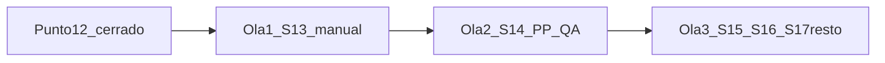

# Plan de implementación — Puntos 13–17 del diseño rector

Fecha: 2026-07-17  
**Autoridad única:** `docs/eve/panel-control/corpus/Diseno_Panel_Control_EVE_Empresa_Cliente_Matriz_XY_Gobernanza_Experiencia_v1_0.docx` (v1.0)  
**Módulo contrastado:** `src/features/official-consultant-control-panel/`, `src/app/api/eve/official-consultant-control-panel/`, `src/services/eve/official-control-panel/`, `supabase/migrations/`, `scripts/eve/`, `tests/`, `reports/`, `docs/eve/panel-control/`  
**Excluido como autoridad de extracción:** documentos de Capa 2.0/2.5, Runtime 40+20 aparte, panel legacy, instrucciones históricas, bundles anteriores (pueden citarse solo como contexto de reutilización técnica ya cerrada en §12).  
**Esta tarea:** documentación únicamente — cero cambios de código, datos, migraciones, UI o pruebas de producto.

Documentos de partida a respetar:

- `RECTOR_POINTS_1_9_IMPLEMENTATION_PLAN.md` / `RECTOR_POINTS_1_9_STATUS_DICTAMEN.md`
- `RECTOR_POINTS_10_12_IMPLEMENTATION_PLAN.md` / `RECTOR_POINTS_10_12_STATUS_DICTAMEN.md`
- Dictámenes de producción del Punto 12 (`POINT12_PRODUCTION_*`, Entrega C)
- `RECTOR_DESIGN_RECONCILIATION_DICTAMEN.md` (estado previo §§13–17)

## Método

Estados permitidos únicamente:

| Estado | Criterio |
|--------|----------|
| CERRADO | Datos/fuente + lógica + UI + autorización + pruebas + evidencia visual cuando aplique |
| PARCIAL | Solo una parte (UI sin datos, persistencia sin UI, shell sin comportamiento, etc.) |
| NO INICIADO | Sin implementación relevante en el panel oficial |
| BLOQUEADO POR DATOS | Falta fuente factual |
| BLOQUEADO POR INFRAESTRUCTURA | Falta plataforma/infra |
| IMPLEMENTADO FUERA DE SECUENCIA | Existe fuera del panel oficial o antes de dependencias rectoras |

Si una afirmación no está en el docx: **No sustentado por el documento rector.**

Partida factual:

- Puntos 1–12: implementados según sus dictámenes.
- Punto 12: **APTO PARA PROMOCIÓN A PRODUCCIÓN** (no desplegado en esta tarea).
- Puntos 13–17: **no iniciados** como capacidades de producto.

---

## 1. Confirmación literal de títulos §§13–17

| Esperado (corto / TOC) | Título exacto en el cuerpo del rector | ¿Coincide con TOC? |
|------------------------|---------------------------------------|--------------------|
| Seguimiento manual P-SUP-03/04/05 | **13. Seguimiento de procesos manuales P-SUP-03, P-SUP-04 y P-SUP-05** | TOC usa forma corta `P-SUP-03/04/05`; cuerpo enumera los tres |
| Producción Paralela y QA | **14. Producción Paralela y QA** | Sí |
| Gobernanza de Experiencia | **15. Gobernanza de Experiencia del Usuario** | Sí |
| Intervención de soporte | **16. Intervención interna de soporte** | Sí |
| Estados y alertas | **17. Estados, reglas de agregación y alertas** | Sí |

### Subsecciones exactas

**§13**

- `13.1 Estado técnico de seguimiento manual`
- `13.2 Panel manual`

**§14**

- `14.1 Readiness visibles`
- `14.2 Reglas de QA`

**§15**

- `15.1 Secuencia de experiencia monitoreada`
- `15.2 Estado por pantalla`

**§16**

- `16.1 Acciones prohibidas`
- `16.2 Contrato mínimo de acción`

**§17**

- `17.1 Separación de vocabularios`
- `17.2 Estado general de Empresa Cliente`
- `17.3 Alertas prioritarias`

---

## 2. Extracción literal obligatoria por punto

### 2.1 §13 — Seguimiento de procesos manuales P-SUP-03, P-SUP-04 y P-SUP-05

| Campo | Contenido literal / derivado solo del rector |
|-------|-----------------------------------------------|
| **Número** | 13 |
| **Título exacto** | Seguimiento de procesos manuales P-SUP-03, P-SUP-04 y P-SUP-05 |
| **Propósito** | Estos procesos existen en el MBA, pero no están configurados como capacidades automáticas de la plataforma. El panel debe gobernar su trabajo mediante un **registro manual separado**. Alcance explícito del documento: no automatizar Capa 2.0/2.5/3; no simular que la plataforma produjo EscenaEvidencial, PeliculaCausalAgregada o DiagnosticoExpertoFinal. |
| **Capacidades funcionales** | Registrar y supervisar trabajo externo P-SUP-03/04/05; preparar/descargar paquete; registrar inicio; adjuntar salida; enviar a revisión; aceptar salida solo con capability y revisión auditada; historial de transiciones. |
| **Objetos y estados observados** | Inputs/outputs MBA: EvidenceBundle `[ReadyForTransduction]` → EscenaEvidencial `[Validated]` (03); 2..\* EscenaEvidencial `[Validated]` → PeliculaCausalAgregada `[Aggregated]` (04); PeliculaCausalAgregada `[Aggregated]` → DiagnosticoExpertoFinal `[Delivered]` (05). Estado técnico: `manual_tracking_status`. |
| **Eventos y timers** | Transiciones de `manual_tracking_status`; aceptación que habilita registro de Object[State] objetivo solo cuando el artefacto manual fue aceptado y el evento causal confirmado. Timer de handoff manual aparece en §17.3 como alerta *Manual handoff overdue* (no definido un timer ID adicional en §13). |
| **Acciones permitidas** | Descargar paquete; Registrar inicio; Adjuntar salida; Enviar a revisión; Aceptar salida (disabled hasta capability y revisión auditada). Capabilities rectoras relacionadas: `manage_manual_work`, `accept_manual_output`. |
| **Acciones prohibidas** | Confundir `manual_tracking_status` con estado OLC; marcar output MBA alcanzado sin aceptación auditada (CP-006); presentar automatización ficticia de Capa 2.0/2.5/3. |
| **Zona visual** | `ManualWorkPanel` (Card + Timeline + Attachments) en modo Empresa Cliente; wireframe §13.2; selección de proceso X P-SUP-03/04/05 MANUAL (§7). |
| **Subvista correspondiente** | **Seguimiento** (historial y evolución del trabajo manual); estado actual también visible en **Monitoreo**; pendientes de aceptación/revisión alimentan **Gobernanza** y drawer Atención. |
| **Dependencias** | Eje X P-SUP (§7); hitos Y / `manual_pending` (§8); EvidenceBundle / insumos de Runtime (§12); registro técnico `manual_process_work_item` (§19.4); BFF `GET .../manual-work`, `POST .../manual-actions` (§19.1). |
| **Criterios de aceptación** | CP-005 (badge MANUAL), CP-006 (sin aceptación no alcanzado), FX-08 (ready_to_start → submitted → accepted). Fase rector §23: **3. Manualidad**. |

#### 13.1 `manual_tracking_status` (lectura literal)

| Valor | Lectura |
|-------|---------|
| `not_ready` | El input MBA todavía no existe. |
| `ready_to_start` | El input existe y el paquete puede prepararse. |
| `downloaded` | El responsable descargó el material. |
| `in_manual_work` | Trabajo manual iniciado. |
| `submitted` | Artefacto devuelto para revisión. |
| `review_required` | Se solicitó ajuste. |
| `accepted` | Salida aceptada y registrada por actor autorizado. |
| `blocked` | Falta evidencia, trazabilidad o condición de entrada. |

Regla literal: `manual_tracking_status` es control técnico de trabajo. **No** es un estado del OLC. El Object[State] objetivo solo se registra cuando el artefacto manual ha sido aceptado y el evento causal fue confirmado.

#### 13.2 Historial mínimo del panel manual

`actor · timestamp · before_status · after_status · artifact_ref · reason`

---

### 2.2 §14 — Producción Paralela y QA

| Campo | Contenido |
|-------|-----------|
| **Número** | 14 |
| **Título exacto** | Producción Paralela y QA |
| **Propósito** | Monitorear la línea lateral de Producción Paralela (P-SUP-06/07/08/09) sin confundirla con la cadena diagnóstica del core. |
| **Capacidades funcionales** | Vista de monitoreo por proceso; mostrar readiness y bloqueos; aplicar reglas QA; gobernar exportación (representa lo validado; no corrige semántica). |
| **Objetos y estados observados** | P-SUP-06: MDSB → candidatos → hechos → semántica → registries → IR → inventario. P-SUP-07/08: conformance → consistency por pares → temporal/estructural → compuesta → findings. P-SUP-09: BPMN / PlantUML → validación → paquete. |
| **Eventos y timers** | Bloqueos clave: missing canonical route, semantic conflict, QA rework, export blocked; WithFindings, Blocked, B3 route, B7 boundary; ACA != Satisfied, sintaxis inválida, IR no validado. Alertas §17.3: QA WithFindings; blocked_by_missing_canonical_route; process_state_without_timer (B4). |
| **Acciones permitidas** | Acciones de panel asociadas a readiness §14.1 (permitir consumo, mostrar flags, reentry, cola experta). Capabilities: `generate_export`, `block_export`. |
| **Acciones prohibidas** | Alinear cosméticamente contradicciones; crear fact desde texto sin ruta canónica; iniciar P-SUP-09 sin ACA `[Satisfied]`; tratar un archivo descargable como resultado procesado/corregido. |
| **Zona visual** | `ParallelProductionPanel` (§18); filtros por P-SUP-06/07/08/09 en eje X. |
| **Subvista correspondiente** | **Monitoreo** (estado/readiness ahora); **Gobernanza** (findings, export blocked, rework); no duplicar Runtime completo. |
| **Dependencias** | Runtime listo / MDSB (§12); frontera B3/B7; BFF `GET .../parallel-production`. **Ola 2 autoriza** registro técnico de observación de panel (`parallel_production_package` / findings) distinto de EvidenceBundle y de Object[State] MBA; generador productivo permanece no disponible en UI. |
| **Criterios de aceptación** | CP-012, CP-013, FX-09, FX-10. Fase §23: **4. Producción Paralela**. |

#### 14.1 Readiness visibles (literal)

| Estado | Acción en panel |
|--------|-----------------|
| `ready` | Permitir consumo. |
| `ready_with_flags` | Mostrar flags; no ocultar. |
| `blocked_by_missing_evidence` | Reentry al bloque/gate. |
| `blocked_by_contradiction` | Reentry o revisión; no alinear cosméticamente. |
| `blocked_by_missing_canonical_route` | Reentry B2/B3; no crear fact desde texto. |
| `manual_review_required` | Cola experta. |
| `reentry_required` | Abrir destino específico. |

#### Distinción operativa obligatoria (§8 del encargo, anclada en el rector)

| Tipo | Qué es | Qué no es |
|------|--------|-----------|
| Operación automática de plataforma | Flujos P-SUP-06/07/08/09 cuando la plataforma los ejecuta | Trabajo manual P-SUP-03/04/05 |
| Operación manual gobernada | Registro §13 | Automatización fingida |
| Descarga de insumo | Paquete/material para trabajo externo o export validado | Resultado metodológico “ya procesado” |
| Resultado externo no administrado por el panel | Artefactos producidos fuera (escenas, película, diagnóstico, diagramas) | Objeto fabricado por la UI |

---

### 2.3 §15 — Gobernanza de Experiencia del Usuario

| Campo | Contenido |
|-------|-----------|
| **Número** | 15 |
| **Título exacto** | Gobernanza de Experiencia del Usuario |
| **Propósito** | Observar la trayectoria real del usuario por la plataforma y permitir soporte interno. **No** interpreta el comportamiento como evidencia causal del negocio. Frontera: modo transversal interno; no se declara como proceso PM nuevo en este documento. |
| **Capacidades funcionales** | Subvistas Trayectorias, Soporte, Salud de pantallas; matriz usuario × pantalla; cola de ayuda; métricas por pantalla. |
| **Objetos y estados observados** | `screen_status`; secuencia §15.1; registro `experience_screen_event` (§19.4) — *No es evidencia del negocio*. |
| **Eventos y timers** | Entrada/salida/error/soporte por pantalla; umbral `stale`; alertas Experience support requested / Screen error recurrent (§17.3). |
| **Acciones permitidas** | Observación; habilitar soporte y revisión de diseño de pantalla (no diagnóstico). Acciones mutables pertenecen a §16. |
| **Acciones prohibidas** | Inferir incompetencia, resistencia, cultura, AHE, VSM o inconsistencia MMABP desde tiempo/intentos/abandono. |
| **Zona visual** | Modo `ExperienceGovernanceMode`: ExperienceTabs, UserJourneyMatrix, SupportQueue, ScreenHealthPanel (§18). |
| **Subvista correspondiente** | **No** es la subvista Empresa Cliente “Gobernanza”. Es **modo** superior separado. |
| **Dependencias** | Instrumentación UI; BFF `GET .../experience-state`; capabilities `view_experience_state`. |
| **Criterios de aceptación** | UX-001, UX-004; vacío “Sin experience events” (§21.1). Fase §23: **5. Experiencia read-only**. |

#### 15.2 `screen_status` (literal)

`not_reached` | `active` | `completed` | `blocked` | `support_requested` | `abandoned` | `stale` | `not_applicable`

---

### 2.4 §16 — Intervención interna de soporte

| Campo | Contenido |
|-------|-----------|
| **Número** | 16 |
| **Título exacto** | Intervención interna de soporte |
| **Propósito** | Aumentar la capacidad del usuario para continuar **sin** alterar evidencia, decisiones metodológicas ni estados MBA. |
| **Capacidades funcionales** | Acciones auditadas de soporte con contrato mínimo §16.2. |
| **Objetos y estados observados** | `experience_support_action`; before/after; `screenKey`; scope caso/usuario/rol/actividad. |
| **Eventos y timers** | Toda intervención requiere `reason_code`, capability, before_state, actor y `audit_ref` (wireframe §5.1). |
| **Acciones permitidas** | Ver tabla §16 abajo. |
| **Acciones prohibidas** | §16.1 completo (ver abajo). |
| **Zona visual** | SupportActionDrawer / detalle de usuario en modo Experiencia; botones del drawer Atención: Abrir detalle, Ver trayectoria, Acción gobernada. |
| **Subvista correspondiente** | Modo Experiencia + drawer Atención y gobernanza; excepciones también alimentan subvista **Gobernanza** Empresa Cliente. |
| **Dependencias** | §15 instrumentación; capabilities `send_support_message`, `request_reentry`, `mark_manual_review`; BFF `POST .../experience-actions`. Secuencia obligatoria §23: no habilitar intervención antes de instrumentación, scope, capabilities y audit trail. |
| **Criterios de aceptación** | UX-002, UX-003; FX-11. Fase §23: **6. Intervenciones**. |

#### Acciones permitidas (literal)

| Acción | Efecto permitido | Nivel |
|--------|------------------|-------|
| Enviar mensaje de ayuda | Orientación contextual sin cambiar estado. | Bajo riesgo |
| Generar enlace de retorno | Permite retomar la misma pantalla/scope. | Bajo riesgo |
| Solicitar reentry | Abre flujo autorizado hacia pantalla o bloque previo. | Medio |
| Marcar manual review | Encola revisión interna sin cerrar evidencia. | Medio |
| Reabrir bloque | Solo si OLC/PF y capability lo autorizan. | Alto |
| Reset de sesión | Solo con política, before-state y audit completos. | Alto |

#### 16.1 Acciones prohibidas (literal)

- Editar respuestas del usuario.
- Responder en nombre del usuario.
- Marcar una pantalla o bloque como completado sin evento.
- Forzar readiness.
- Cerrar una causal o gap manualmente sin ruta autorizada.
- Cambiar de rol funcional sin corrección de WorkMap/Estado A.
- Impersonar al usuario.
- Saltar B0, B2, B3 o B7.

#### Contrato mínimo (literal tipado del rector)

`ExperienceSupportAction`: `actionId`, `caseId`, `userId`, `roleRuntimeSessionId?`, `activityId?`, `screenKey`, `actionType` ∈ `send_message` | `resume_link` | `request_reentry` | `mark_manual_review` | `reopen_block` | `session_reset`, `reasonCode`, `beforeState`, `expectedEffect`, `capability`, `actorId`, `createdAt`, `auditRef`.

---

### 2.5 §17 — Estados, reglas de agregación y alertas

| Campo | Contenido |
|-------|-----------|
| **Número** | 17 |
| **Título exacto** | Estados, reglas de agregación y alertas |
| **Propósito** | Separar vocabularios; calcular estado general de Empresa Cliente por jerarquía explícita (no media opaca); emitir alertas prioritarias con scope y respuesta. |
| **Capacidades funcionales** | Motor de agregación BFF; ítems de Atención; KPIs de alertas de experiencia. |
| **Objetos y estados observados** | Ver 17.1–17.3. |
| **Eventos y timers** | Timers core; handoffs manuales; findings QA; soporte experiencia. |
| **Acciones permitidas** | Respuestas listadas en 17.3 (abrir detalle, reentry, escalar responsable, abrir soporte, etc.) — como navegación/acción gobernada, no como mutación libre. |
| **Acciones prohibidas** | Fusionar vocabularios; calcular estado empresa como porcentaje opaco; interpretar alertas UX como diagnóstico de negocio. |
| **Zona visual** | Cabecera Atención; KPI alertas; `AttentionDrawer`; chips de estado. |
| **Subvista correspondiente** | Transversal: alimenta Monitoreo (ahora), Seguimiento (evolución de alertas resueltas — *proyección*; detalle de timeline no listado explícitamente en §17), Gobernanza (pendientes críticos). |
| **Dependencias** | Datos de §§8–16 según alerta; proyección BFF; insumos §12 (gaps/timers/reentry/review). |
| **Criterios de aceptación** | Implicit en CP/UX de alertas asociadas; vacío y degradación §21. |

#### 17.1 Vocabularios (literal)

| Vocabulario | Ejemplo | Autoridad |
|-------------|---------|-----------|
| Business Object[State] | CasoDiagnosticoEVE `[ReadyForTransduction]` | Dominio MBA |
| Operational display status | active / waiting / blocked / completed | BFF derivado desde datos reales |
| Manual tracking status | in_manual_work / submitted / accepted | Registro técnico manual |
| Experience screen status | active / blocked / stale / abandoned | Instrumentación UI |
| Attention severity | info / warning / critical | Regla de monitoreo |

#### 17.2 Jerarquía Empresa Cliente (literal, orden)

1. **Cerrado:** CasoDiagnosticoEVE está en un final.  
2. **Bloqueado:** el hito actual tiene blocker crítico, timer vencido sin salida resuelta o input manual faltante.  
3. **Atención:** existen flags, soporte requerido, manual due soon, role gap o findings recuperables.  
4. **En curso:** no existe bloqueo crítico y hay próximo evento válido.  
5. **No iniciado:** ClientEngagement no ha abierto caso.

#### 17.3 Alertas prioritarias (literal)

| Alerta | Scope | Respuesta |
|--------|-------|-----------|
| Timer core próximo/vencido | Caso / hito | Abrir detalle y salida causal. |
| ROLE_ASSIGNMENT_GAP | Usuario / rol | Revisar Estado A/WorkMap. |
| workmap_coverage_gap | Usuario / rol | Microconfirmar cobertura. |
| blocked_by_missing_canonical_route | Actividad / B2 o B3 | Reentry a ruta crítica. |
| process_state_without_timer | Actividad / B4 | Abrir C11/PST gate. |
| Manual handoff overdue | P-SUP-03/04/05 | Escalar responsable. |
| QA WithFindings | P-SUP-06/07/08 | Abrir rework. |
| Experience support requested | Usuario / pantalla | Abrir soporte. |
| Screen error recurrent | Pantalla | Revisión de producto. |

---

## 3. Relación con Monitoreo, Seguimiento y Gobernanza

### 3.1 Preguntas rectoras (§6)

| Subvista | Pregunta | Acción principal |
|----------|----------|------------------|
| Monitoreo | ¿Qué está ocurriendo ahora? | Detectar dónde está el caso. |
| Seguimiento | ¿Cómo evolucionó el caso, objeto, run, gap o decisión en el tiempo? | Entender qué cambió y qué falta. |
| Gobernanza | ¿Qué excepción requiere decisión, autorización, reentry, revisión, bloqueo o escalamiento? | Resolver lo que impide avanzar. |

### 3.2 Asignación de capacidades §§13–17

| Capacidad | Monitoreo | Seguimiento | Gobernanza (subvista) | Atención y gobernanza (drawer) | Modo Experiencia |
|-----------|-----------|-------------|------------------------|--------------------------------|------------------|
| §13 estado actual `manual_tracking_status` | Sí | No (solo snapshot) | Si pendiente crítico | Sí (P-SUP-03 pendiente) | No |
| §13 historial actor/timestamp/before/after | No | **Sí** | No como timeline completo | Enlace Abrir detalle | No |
| §14 readiness/findings ahora | Sí | No | Sí (findings/export) | Sí (QA findings) | No |
| §14 rework/export gobernado | Señal | Eventos de cambio si auditados | **Sí** decisión | Acción gobernada | No |
| §15 trayectorias/salud | No | No | No | Ver trayectoria (enlace) | **Sí** |
| §16 intervenciones | No | Auditoría de acciones en timeline si se registra | Cola de excepciones | **Acción gobernada** | **Sí** |
| §17 alertas / jerarquía empresa | Contadores ahora | Evolución de alertas resueltas (si hay eventos) | Cola de decisión | **Lista + botones** | Alertas UX |

**Regla anti-duplicación:** no volver a montar Runtime 40+20 completo en Seguimiento ni en Gobernanza. Monitoreo ya posee matrices Base/Causal (§12). Seguimiento consume **eventos factuales**; Gobernanza consume **excepciones accionables**.

### 3.3 Shells actuales (auditoría UI)

| Elemento | Estado factual |
|----------|----------------|
| Subvista Seguimiento (`view=tracking`) | Shell vacío (`NonProcessWorkspace`) |
| Subvista Gobernanza (`view=governance`) | Shell vacío |
| Modo Gobernanza de Experiencia | Tab visible, **deshabilitado** (“Próximamente”) |
| Drawer Atención y gobernanza | PARCIAL: listas read-only de gaps/timers/reentry/review (§12 Entrega C); sin `[Abrir detalle]` / `[Ver trayectoria]` / `[Acción gobernada]` mutables §16 |
| KPI “Alertas de experiencia” | Shell (`—`) |
| `ManualWorkPanel` / `ParallelProductionPanel` | No cableados en shell activo |
| Botones §13 (Descargar… Aceptar salida) | No implementados |
| Export PP | No implementado en panel oficial |

### 3.4 Reutilización del Punto 12 (sin estructuras duplicadas)

| Activo §12 | Reuso en §§13–17 |
|------------|------------------|
| Ledger causal + resolutions + evidence | Eventos de Seguimiento; evidencia de cierre; no inventar timeline |
| `runtime_run_control_snapshots` | Readiness agregado; insumos §17 / Atención |
| P3 gaps / timers / reentry / manual review | Señales Gobernanza y drawer; filtros ya existentes en matrices |
| BFF `.../runtime/control-state` + matrices | Patrón de lectura autorizada; no clonar Runtime en otras subvistas |
| `AttentionGovernancePanel` + provider | Base del drawer; extender con alertas §17.3 y acciones §16 cuando toque |
| RLS consultor + verifiers | Extender a nuevos registros §19.4, no rediseñar identidad |

Registros **nuevos** exigidos por el rector (§19.4), no duplicados del ledger:

- `manual_process_work_item`
- `experience_screen_event`
- `experience_support_action`
- `control_panel_projection` (vista materializada/consulta BFF — *No es fuente metodológica*)

---

## 4. Auditoría del repositorio (matriz de estado)

| Punto | Capacidad | Persistencia | BFF | UI | Pruebas | Estado |
|-------|-----------|--------------|-----|----|---------|--------|
| 13 | Panel manual + `manual_tracking_status` + historial | Tabla `manual_process_work_item` + eventos | GET `manual-work`; POST `manual-actions` deshabilitado | Seguimiento `ManualWorkPanel`; Atención overdue read-only | Regresión §13 + e2e Amber vacío | **OLA 1 APTA (sin deploy)** |
| 14 | Monitoreo PP/QA + export gobernado | Tablas observación panel + findings; proyección BFF | GET `parallel-production` | `ParallelProductionPanel` + Atención | Regresión + e2e Amber/opval | **OLA 2 APTA (sin deploy)** |
| 15 | Modo + trayectorias / soporte / salud | `experience_screen_event` (Ola 3) | `experience-state` (Ola 3) | Modo habilitado Ola 3 | OpVal UX fixtures | **OLA 3 EN CURSO — Tramo A** |
| 16 | Intervenciones auditadas | `experience_support_action` (Ola 3) | `experience-actions` (Ola 3) | Acciones gobernadas Ola 3 | UX-002/003 | **OLA 3 EN CURSO — Tramo B** |
| 17 | Vocabularios + jerarquía + alertas | Insumos §12–14 + experiencia | proyección BFF §17 | Atención + KPI factual | Copy R2 | **OLA 3 EN CURSO — Tramo C** |

### Bloqueos

| Bloqueo | Tipo | Impacto |
|---------|------|---------|
| Instrumentación de pantallas ausente | BLOQUEADO POR DATOS / INFRA (para §15–16) | No hay `experience_screen_event` |
| Artefactos MBA manuales/PP producidos fuera | Frontera de diseño (no bug) | Panel registra; no fabrica Object[State] |
| Object[State] engagement/caso completo en cabecera | PARCIAL histórico §§6–8 | Jerarquía §17.2 completa depende de datos de caso/hito |

---

## 5. Arquitectura temporal para Seguimiento

### 5.1 Contrato de evento factual

| Campo | Definición |
|-------|------------|
| objeto observado | caso / hito / `manual_process_work_item` / run / gap / decisión / snapshot / pantalla experiencia |
| evento | transición de status o publicación auditada |
| estado anterior | `before_status` / beforeState / versión ledger previa |
| estado nuevo | `after_status` / after / versión publicada |
| actor | `actorId` / actor del historial |
| fecha | timestamp del evento (no usar solo `updated_at` de fila si no es el evento) |
| causa | `reason` / `reasonCode` |
| referencia | `artifact_ref` / `auditRef` / evaluation_id / snapshot_id / request_id |

### 5.2 Fuentes reales existentes (reutilizar)

| Fuente | Qué aporta |
|--------|------------|
| `runtime_causal_evaluations` (+ resolutions, evidence links) | Versiones, superseded/revoked, historial de evaluaciones |
| `runtime_run_control_snapshots` | Cambios de readiness agregado |
| `readiness_gap_record` | Gaps abiertos/resueltos |
| `process_state_timer_event` | Timers |
| `readiness_decision_record` | Reentry / revisión manual |
| `runtime_audit_trail` (P3) | Auditoría técnica (sin UI oficial hoy) |
| Hitos core / logros (§8) | Hitos alcanzados |
| Selección de actividades (§11) | Cambios de cobertura / modos |

### 5.3 Fuente nueva obligatoria para §13

Historial de `manual_process_work_item` con el esquema de campos del wireframe §13.2.

---

## 6. Arquitectura de Gobernanza (acciones)

Solo se autorizan acciones con condición factual, actor, estados, resultado, auditoría y vía de corrección/reversión cuando el rector la implica (p. ej. `review_required`, reset con before-state).

### 6.1 Acciones sustentadas por el rector

| Acción | Condición | Actor autorizado | Estado previo | Estado posterior | Auditoría | Endpoint (propuesto §19.1) |
|--------|-----------|------------------|---------------|------------------|-----------|----------------------------|
| Descargar paquete | `ready_to_start` + capability `manage_manual_work` | Consultor/experto interno | `ready_to_start` | `downloaded` | Historial §13.2 | `POST .../manual-actions` |
| Registrar inicio | Tras descarga / ready | Idem | `downloaded` (u origen permitido) | `in_manual_work` | Idem | Idem |
| Adjuntar salida | Trabajo en curso | Idem | `in_manual_work` | (artefacto ref; status según flujo) | `artifact_ref` | Idem |
| Enviar a revisión | Salida adjunta | Idem | `in_manual_work` | `submitted` | Idem | Idem |
| Aceptar salida | Capability `accept_manual_output` + revisión auditada | Actor autorizado | `submitted` / post-review | `accepted` | Idem + evento causal | Idem |
| Solicitar ajuste | Revisión | Autorizado | `submitted` | `review_required` | Idem | Idem |
| Enviar mensaje de ayuda | §16 + `send_support_message` | Soporte interno | beforeState | sin cambio de evidencia | `experience_support_action` | `POST .../experience-actions` |
| Generar enlace de retorno | §16 | Idem | beforeState | resume mismo scope | Idem | Idem |
| Solicitar reentry | §16 + `request_reentry` | Idem | beforeState | flujo reentry | Idem | Idem |
| Marcar manual review | §16 + `mark_manual_review` | Idem | beforeState | cola review | Idem | Idem |
| Reabrir bloque | Alto; OLC/PF + capability | Autorizado | beforeState | bloque reabierto | Idem | Idem |
| Reset de sesión | Alto; política + before + audit | Autorizado | beforeState | reset | Idem | Idem |
| `generate_export` | §14.2 validado / ACA según proceso | Autorizado | export bloqueado o pendiente | paquete export | Audit + capability | Paralelo a capability (detalle de ruta HTTP **No sustentado** más allá de capabilities) |
| `block_export` | Condición de no satisfacción / bloqueo | Autorizado | export permitido | bloqueado | Idem | Idem |
| Abrir detalle | Ítem §17.3 | Consultor | — | Navegación a scope | request_id | Drawer → BFF scope |
| Ver trayectoria | Ítem atención / usuario | Consultor | — | Modo experiencia / matriz | Idem | Idem |
| Acción gobernada | Ítem + capability | Autorizado | — | Abre contrato §16 o manual | Idem | Idem |

### 6.2 Acciones del enunciado de planificación no literales en §§13–17

Las siguientes frases del encargo de planificación **no** aparecen como acciones tipadas en §§13–17 del docx; no se inventan endpoints:

- bloquear avance (como acción genérica)
- solicitar aclaración
- resolver excepción (genérico)
- escalar (salvo “Escalar responsable” en alerta Manual handoff overdue)
- rechazar promoción
- devolver a proceso de soporte

**Marca:** *No sustentado por el documento rector* — no autorizar en implementación sin cambio controlado del diseño.

---

## 7. Orden acelerado de ejecución (máximo tres olas)

Alineado a §23 (Fases 3 → 4 → 5/6) y dependencia causal:

| Ola | Puntos y títulos exactos | Justificación causal | Cierre productivo obligatorio |
|-----|--------------------------|----------------------|-------------------------------|
| **1** | **§13 Seguimiento de procesos manuales P-SUP-03, P-SUP-04 y P-SUP-05** + mínimo §17.1 (vocabulario manual) + alerta §17.3 *Manual handoff overdue* en Atención | Fase 3 Manualidad; H2/`manual_pending` y subvista Seguimiento dependen del registro; no requiere instrumentación UX | Build productivo; migraciones reproducibles (`manual_process_work_item` + historial); rollback; RLS A/B; BFF seguro; observabilidad; pruebas oficiales (FX-08, CP-005/006); accesibilidad; auditoría; cero secretos; cero rutas locales productivas; dictamen **APTO PARA PROMOCIÓN A PRODUCCIÓN** o **BLOQUEADO**. **No desplegar** hasta go-no-go. |
| **2** | **§14 Producción Paralela y QA** + alertas §17.3 QA / route / process_state_without_timer según datos PP | Fase 4; línea paralela tras manualidad del core; no mezclar con Experiencia | Mismo umbral productivo |
| **3** | **§15 Gobernanza de Experiencia del Usuario** + **§16 Intervención interna de soporte** + resto §17.2/§17.3 (jerarquía empresa + alertas experiencia) | Fases 5–6; intervención exige instrumentación (§23 secuencia obligatoria) | Mismo umbral; sin deploy automático |

---

## 8. Endpoints y componentes rector (§18–§19) — mapa de implementación futura

No implementar en esta tarea. Referencia vinculante:

| Rector | Uso |
|--------|-----|
| `GET .../manual-work` | §13 lectura |
| `POST .../manual-actions` | §13 mutaciones auditadas |
| `GET .../parallel-production` | §14 |
| `GET .../experience-state` | §15 |
| `POST .../experience-actions` | §16 |
| `ManualWorkPanel` | UI §13 |
| `ParallelProductionPanel` | UI §14 |
| `UserJourneyMatrix` / `SupportQueue` / `ScreenHealthPanel` / `SupportActionDrawer` | UI §15–16 |
| `AttentionDrawer` | §17 + acciones |

Nota de ruta: el docx propone `/admin/consultant-control-panel` y `/api/eve/consultant/control-panel/...`. El producto oficial instalado usa `/admin/official-consultant-control-panel` y `/api/eve/official-consultant-control-panel/...`. La equivalencia de superficie es de implementación; **no** se cambia la autoridad del diseño en este plan.

---

## 9. Confirmación de esta tarea

- Entregables: este plan + `RECTOR_POINTS_13_17_STATUS_DICTAMEN.md`.
- **Cero** cambios en `src/`, migraciones, tests de producto o scripts operativos de runtime.
- **No** se inicia implementación de Ola 1 en esta tarea.

---

## 10. Decisión operativa

Ver dictamen hermano: **SIGUIENTE OLA EJECUTABLE = Ola 1 — §13 Seguimiento de procesos manuales P-SUP-03, P-SUP-04 y P-SUP-05**.
