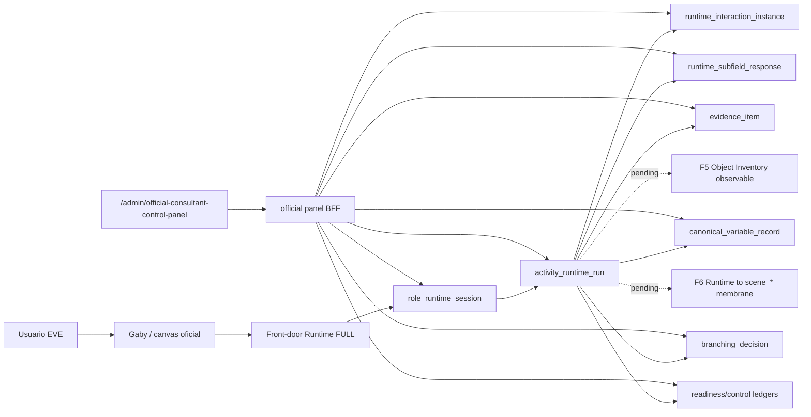

# 045-R3B-PANEL-AUDIT-R1 — Auditoría material del Panel oficial contra Runtime / same run

Fecha: 2026-08-12
Worktree auditado: `C:\Users\migue\Documents\Catalogo de preguntas y funcionalidad operativa - Implementacion-significado-clean-clone\external-consumers\eve-platform-operational-baseline-c312`
Modo: lectura de checkout vivo. No se consultó staging ni producción. No se ejecutó E2E navegador.

## 1. Identificación del panel oficial

| Control | Resultado |
| --- | --- |
| Panel oficial identificado | true |
| URL oficial | `/admin/official-consultant-control-panel` |
| Archivo route | `external-consumers/eve-platform/src/app/admin/official-consultant-control-panel/page.tsx` |
| Componente raíz | `external-consumers/eve-platform/src/features/official-consultant-control-panel/components/OfficialControlPanelShell.tsx` |
| Árbol de componentes | `external-consumers/eve-platform/src/features/official-consultant-control-panel/components/*` |
| Árbol de datos/hooks | `external-consumers/eve-platform/src/features/official-consultant-control-panel/{data,hooks,state,presentation,types}` |
| Servicios BFF/server | `external-consumers/eve-platform/src/services/eve/official-control-panel/*` |

Evidencia: el route declara `PANEL_PATH = "/admin/official-consultant-control-panel"`, comentario `Official EVE Control Panel`, gate server-side por consultor y render de `OfficialControlPanelShell`. La ruta `/consultant/control-panel` redirige a `/admin/consultant-control-panel`; el route legacy se autodeclara `LEGACY / DRAFT MODULE` y `Not the official EVE Control Panel`.

## 2. Materialidad pre-Runtime / WorkMap

| Superficie | Evidencia material | Estado |
| --- | --- | --- |
| Contexto autorizado empresa-relación-caso | `client-context-api.ts` consume `/api/eve/official-consultant-control-panel/client-companies`, relationships y cases | implemented_and_connected |
| Participantes/perfiles | hooks `useCaseParticipants`, rutas `participants`, `profiles` | implemented_and_connected |
| WorkMap progress | `useCaseWorkMapProgress`, API `/cases/:caseId/workmap-progress`, servicio `official-control-panel-workmap-progress-service.ts` | implemented_and_connected |
| Activity selection conformance | API `/activity-selection/:selectionResultId/items/:itemId/conformance`, componente `CaseParticipantsPanel.tsx` muestra `role_runtime_session_id` y `activity_runtime_run_id` como procedencia | implemented_and_connected |
| User indicator matrix | `useCaseUserIndicatorMatrix`, servicio lee runs y métricas Runtime agregadas | implemented_and_connected |

## 3. Frontera observada Panel ↔ Runtime

| Capa | Ruta / servicio | Tablas leídas | Estado |
| --- | --- | --- | --- |
| Sesiones Runtime por perfil | `/monitoring/roles/:profileId/sessions`, `official-control-panel-monitoring-runtime-repository.ts` | `case_profile_runtime_session_links`, `role_runtime_session` | implemented_and_connected |
| Runs por sesión | `/monitoring/roles/:profileId/activities` | `activity_runtime_run` | implemented_and_connected |
| Métricas de run | `loadRuntimeRunMetrics` | `runtime_interaction_instance`, `runtime_subfield_response`, `evidence_item`, `canonical_variable_record` | implemented_and_connected |
| Matriz Base 40 | `/runs/:runId/runtime/base-matrix`, `official-control-panel-runtime-matrix-repository.ts` | `activity_runtime_run`, `role_runtime_session`, `runtime_interaction_instance`, `runtime_interaction_mapping`, `source_node_ref`, `runtime_subfield_response` | implemented_and_connected for read path |
| Matriz Causal 20 | `/runs/:runId/runtime/causal-matrix` | `runtime_causal_evaluations`, `runtime_causal_variable_resolutions`, `runtime_causal_required_variable_rules`, `branching_decision` | partial: degrada a vacío si tablas no existen |
| Control/readiness | `/runs/:runId/runtime/control-state` | `runtime_run_control_snapshots`, `readiness_gap_record`, `process_state_timer_event`, `readiness_decision_record` | partial: lectura soportada, depende de ledgers efectivos |

## 4. Mapa de IDs same-run

| ID | Fuente observada | Uso en panel | Conformance |
| --- | --- | --- | --- |
| `caseId` | contexto del panel | scope de todas las rutas oficiales | required |
| `participantId` | participante de caso | autorización Runtime matrix | required |
| `profileId` | perfil funcional | vínculo a `case_profile_runtime_session_links` | required |
| `roleRuntimeSessionId` / `sessionId` | link perfil↔Runtime | path param y query de sesiones/actividades | required |
| `activityId` | actividad primaria seleccionada | debe existir en coverage primaria | required |
| `activityRuntimeRunId` / `runId` | `activity_runtime_run.activity_runtime_run_id` | path de matrices y control-state | required |
| `catalogVersionId` | `activity_runtime_run.catalog_version_id` | matriz lee catálogo/mappings | observed, not authoring |

El guard `authorize-runtime-matrix-scope.ts` valida antes de abrir matrices: UUIDs opacos, acceso consultor, caso-relación-empresa, participante habilitado, perfil del participante, sesión Runtime vinculada al perfil/caso, actividad primaria en coverage y run con mismo `caseId`, `roleRuntimeSessionId` y `activityId`.

## 5. Panel ↔ Runtime por bloque

| Dominio | Evidencia de panel | Estado |
| --- | --- | --- |
| B0 / B0.5 visible | `RuntimeActivityMatrixPanel.tsx` muestra Matriz Base, filtros B0/B0.5 y fallback “Runtime B0 localizado...” | partial: UI lista y fallback; requiere run efectivo para overlay factual |
| Base 40 | API y repo dedicados | implemented_and_connected read-only |
| Causal 20 | API y repo dedicados | partial: repositorio soporta causal ledger, pero ausencia de tablas degrada a vacío |
| Branching | lee `branching_decision` y lo presenta en overlays | partial: lectura sí, ejecución/autoridad no pertenece al panel |
| Budget | no se observó lectura específica de budget en panel oficial | absent_for_panel |
| Readiness | lee snapshots/gaps/timers/decisions | partial: observabilidad existe si ledgers están materializados |
| Audit trail | requestId + `logOfficialPanelEvent` en rutas Runtime; experience/manual work tienen requestId/capabilities | partial: auditoría técnica sí, replay end-to-end same-run no probado aquí |
| Refresh/live | hooks cliente tienen `retry`; matrices usan fetch al montar/cambiar scope; no se encontró streaming/realtime como requisito material | manual_refresh / fetch_on_scope_change |

## 6. F5 Object Inventory

| Evidencia | Dictamen |
| --- | --- |
| Existe árbol `src/services/eve/runtime-40-20/object-inventory/` y menciones `runtime_object_binding_ref` en canonical variable. | F5 material histórico/candidato existe en Runtime, no aparece como superficie oficial consumida por el panel. |
| Múltiples servicios/guards conservan `object_inventory_real_opened=false`, `object_inventory_created=false`, `runtime_object_binding_real_created=false`. | El panel no puede afirmar Object Inventory final real como observable cerrado. |
| No se encontró route oficial de panel que lea explícitamente un ledger F5 final. | Gap: exponer F5 persistente/autoridad Runtime↔Scene al panel o mapearlo dentro de readiness/control-state si esa es la frontera aprobada. |

Estado F5 para panel: `partial_not_panel_observable`.

## 7. F6 Integration Membrane

| Evidencia | Dictamen |
| --- | --- |
| `client-membrane` y `critical-gates` contienen candidatos/guardas de membrana. | Materialidad de diseño/guard existe. |
| Guardas mantienen `scene_write_detected=false`, `scene_canonical_record_real_created=false`, `outbox_real_created=false`, `scene_projection_attempted` bloqueado. | No hay proyección final `Runtime → scene_*` observable como completada por el panel. |
| El panel sí puede leer Runtime run/control, pero no una membrana final/outbox aplicada a `scene_*`. | Gap: F6 staging/material real debe producir ledgers o estados legibles por el panel. |

Estado F6 para panel: `partial_not_panel_observable`.

## 8. Readiness

| Evidencia | Estado |
| --- | --- |
| `official-control-panel-runtime-matrix-repository.ts` lee `runtime_run_control_snapshots`, `readiness_gap_record`, `process_state_timer_event`, `readiness_decision_record`. | observability_path_implemented |
| `RuntimeActivityMatrixPanel.tsx` presenta footer de avance, badges de brecha/timer/reentry/revisión y filtros readiness. | presentation_implemented |
| Si las tablas no existen o no tienen filas efectivas, el repositorio degrada a `[]`/`null`. | data_materiality_dependent |

Dictamen readiness para panel: `partial_until_effective_same_run_ledgers_exist`.

## 9. Autoridad del panel

| Control | Resultado |
| --- | --- |
| Panel como autoridad Runtime | false |
| Panel escribe Runtime 40/20 | no evidence found |
| Frontera Runtime leída | BFF server-side autorizado con Supabase client de sesión |
| Riesgo de autoridad | no RISK_FOUND por código inspeccionado |

El panel no debe ser fuente de autoridad de Runtime: consume snapshots, ledgers, mappings y estados. Las mutaciones encontradas pertenecen a dominios de experiencia/manual work y están fuera de la carga Runtime 40/20.

## 10. Deuda `pg` factual

Búsqueda `pg` en `src`, `tests` y `package.json` no encontró imports productivos `from "pg"`, `require("pg")` ni `new Pool` en rutas del panel oficial. Solo aparecen usos de `psql` en pruebas locales de CatalogLoader. Impacto factual para panel: no bloquea la observabilidad oficial actual; la deuda `pg` pertenece a harness/local DB y no al Panel BFF inspeccionado.

## 11. Matriz de gaps

| Gap | Evidencia | Impacto same-run | Próxima conexión mínima |
| --- | --- | --- | --- |
| B0.5 overlay efectivo no probado en panel oficial sobre run real | UI y API existen, pero esta auditoría no ejecuta R3A-U ni navegador | `same_run_panel_observability_ready=false` | Ejecutar E2E autenticado same-run después de completar ledgers |
| F5 no observable en panel | F5 guarda/candidato; `object_inventory_*_created=false` | Panel no puede monitorear Object Inventory real | Conectar ledger F5 persistente a control-state/readiness o endpoint oficial |
| F6 no observable en panel | `scene_write_detected=false`, `outbox_real_created=false` | Panel no puede verificar Runtime→scene_* | Materializar F6/outbox y exponer estado de proyección en same-run |
| Causal/readiness dependen de tablas efectivas | Repositorio degrada si tablas no existen | Panel puede mostrar vacío/no disponible | Garantizar ledgers de causal/readiness para el run staging |
| Budget no encontrado en panel oficial | búsqueda panel no encontró budget route/ledger | No hay seguimiento budget en panel | Crear solo si gate EVE lo autoriza más adelante |
| Live/realtime no encontrado | hooks tienen retry/fetch, no streaming | Monitoreo no es live push | Definir si refresh manual basta o si se requiere Realtime después |

## 12. Same-run map



## 13. Próximas conexiones mínimas exactas

1. Ejecutar el roundtrip autenticado real de Gaby para obtener `caseId`, `participantId`, `profileId`, `roleRuntimeSessionId`, `activityId`, `activityRuntimeRunId` del mismo run.
2. Verificar que el panel abre `/admin/official-consultant-control-panel` y selecciona el mismo contexto sin fixture.
3. Validar APIs oficiales de matrices con esos IDs: sessions, activities, base-matrix, causal-matrix y control-state.
4. Materializar o exponer F5 como dato de observabilidad si `object_inventory` ya quedó persistente en staging.
5. Materializar o exponer F6 como dato de observabilidad si la membrana Runtime→`scene_*` ya quedó persistente en staging.
6. Solo después, ejecutar E2E navegador del panel sobre el mismo run.

## 14. Dictamen final

```text
official_panel_identified=true
official_panel_url=/admin/official-consultant-control-panel
pre_runtime_panel_monitoring=implemented_and_connected
activity_runtime_run_observability=partial_read_path_implemented_same_run_not_e2e_verified
same_run_panel_observability_ready=false
panel_runtime_authority=false
B05_PANEL_CONNECTION_GAPS=["same_run_browser_e2e_not_executed", "f5_object_inventory_not_panel_observable", "f6_runtime_scene_membrane_not_panel_observable", "effective_causal_readiness_ledgers_required", "budget_panel_surface_absent", "live_refresh_realtime_not_materialized"]
```

Seguridad:

```text
staging consulted: no
staging writes: none
production consulted: no
remote writes: none
catalog activated: no
B0 modified: no
B1 modified: no
Gaby modified: no
commit created: no
code modified: no
sql modified: no
```