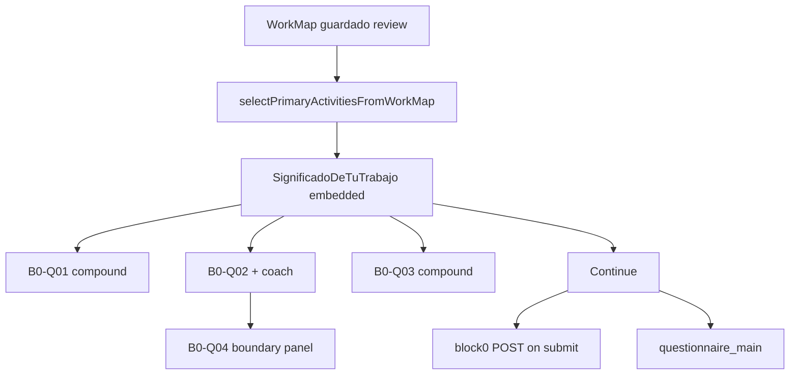

# SIGNIFICADO UI — Operational Freeze V1

**Código de freeze:** `SIGNIFICADO_UI_OPERATIONAL_FREEZE_V1`  
**Versión UI registrada:** `SIGNIFICADO_UI_VERSION = "1.0.0-frozen"` (`src/features/significado/significado-copy.ts`)  
**Closeout visual previo:** `docs/audits/CLOSEOUT_SIGNIFICADO_UI_VISUAL_FINAL_FROZEN_V1_0.md`  
**Contrato visual rector:** `docs/eve-workmap-ui-contract.md`  
**Fecha de freeze operativo:** 2026-06-15  
**Alcance:** pantalla **Significado de tu trabajo** como baseline visual-operativo previo a Runtime Block0 Adapter R0.  
**Fuera de alcance:** Runtime engine completo, rediseño, WorkMap H12, `page.tsx`, APIs, Supabase.

---

## Nota R1 · Fuente formal de Bloque 0

Desde `SIGNIFICADO-CONSUME-RUNTIME-BLOCK0-ADAPTER-R1`, las preguntas B0-Q01...B0-Q04 que consume la pantalla se derivan de `getRuntimeBlock0InteractionViewModels()` mediante la capa de compatibilidad `src/features/significado/runtime-block0-canonical.ts`.

Esta nota no cambia el freeze visual-operativo: la pantalla conserva layout, copy visible humano, subcampos aprobados, patrón inicio/cierre y metadata interna no visible.

---

## 1. Propósito del freeze

Este documento congela **lo que existe hoy** en producto como superficie operativa de Bloque 0 (B0-Q01…B0-Q04), sin rediseñar ni implementar Runtime.

La pantalla sirve para:

1. Revisar y confirmar la actividad principal seleccionada internamente.
2. Capturar descripción operativa asistida (B0-Q02).
3. Capturar frecuencia y contexto (B0-Q03).
4. Confirmar inicio y cierre derivados de la descripción operativa (B0-Q04).
5. Entregar `block0Answers` en el submit hacia el pipeline posterior.

---

## 2. Dónde opera la pantalla

### 2.1 Producción (flujo principal)

| Aspecto | Estado congelado |
|---|---|
| Montaje | `SignificadoDeTuTrabajo` desde `src/app/page.tsx` cuando `flowState === "intake_significado"` |
| Layout | `embedded` (default) — solo columna principal, sin sidebar EVE propio |
| Shell externo | `ClientShell variant="default"` (sidebar oscuro 140px) — **no** es el shell WorkMap gris 224px |
| Entrada | `continueFromWorkMapToSignificado` tras WorkMap guardado en review |
| Salida | `submitSignificadoIntake` → `questionnaire_main` |
| Retorno | `onBack` → `intake_work_map` |
| Precondición | `workMap` persistido; sin mapa → fallback mínimo en `page.tsx` |

### 2.2 QA / desarrollo

| Aspecto | Estado congelado |
|---|---|
| Ruta | `/dev/significado` → `src/app/dev/significado/page.tsx` |
| Layout | `standalone` — shell completo WorkMap (sidebar gris + journey steps + guía) |
| Fixture WorkMap | `createSignificadoBlock0DevWorkMap()` inline (Finanzas / Oracle) |
| Prefill demo | `DEV_VISUAL_DRAFT` manual (B0-Q01 parcial + B0-Q03; B0-Q02/B0-Q04 vacíos) |
| Session dev | `SIGNIFICADO_DEV_SESSION_ID = "dev-significado-slice"` |
| Continue | no-op en dev |

**Nota:** `createSignificadoDevWorkMap()` en `significado-dev-fixture.ts` **no** alimenta `/dev/significado`.

---

## 3. Qué queda aprobado como pantalla base

### 3.1 Estructura visual (congelada V1.0)

- Hoja central estilo WorkMap: `workMapRow` + `sectionCell` (izq.) + `contentCell` (der.).
- Grid observado: `240px | 1fr`.
- Tarjeta: `workMapCard` con header, tabla de preguntas, footer con CTA.
- Encabezado humano vía `ClientFlowHeader` (saludo, título, subtítulo, progreso).
- Paleta neutra Significado (`--sig-accent: #4d4d4d`) + acentos semánticos coach (azul) y boundary (verde).
- Responsive en `significado-de-tu-trabajo.module.css` (900 / 768 / 640 px).
- Sin badges epistemológicos visibles al usuario.
- Sin jerga Runtime/VSM/MMABP/payload/gates/score en copy renderizado (protegido por tests).

### 3.2 Bloque 0 materializado (B0-Q01…B0-Q04)

Fuente: `RUNTIME_BLOCK0_CANONICAL_QUESTIONS` en `src/features/significado/runtime-block0-canonical.ts` (constante TS derivada del catálogo; **no** lee XLSX en runtime).

| ID | Título sección UI | Tipo UI | `sourceRuntimeInteractionId` |
|---|---|---|---|
| B0-Q01 | Confirmar actividad | compound (4 subcampos visibles) | B0-Q01 |
| B0-Q02 | Descripción operativa de tu actividad | textarea + coach | B0-Q02 |
| B0-Q03 | Frecuencia y contexto en el que la actividad se presenta | compound (3 text) | B0-Q03 |
| B0-Q04 | Inicio y cierre | panel por sección (no textarea canónico) | B0-Q04 |

**Ayudas:**

| Pregunta | `helpTextKind` | `canonicalHelpStatus` |
|---|---|---|
| B0-Q01 | canonical | present |
| B0-Q02–Q04 | fallback_no_canonico | CANONICAL_HELP_MISSING |

`technicalLabel`, `helpTextSource`, `canonicalVariables` y `epistemicState` existen en metadata interna; **no** se muestran como etiquetas al usuario.

### 3.3 Coach de descripción operativa (B0-Q02) — CONECTADO

| Pieza | Archivo |
|---|---|
| Hook | `src/hooks/use-operational-description-coach.ts` |
| Intro guide | `src/hooks/use-operational-description-intro-guide.ts` |
| Motor determinista | `src/services/operational-description-coach/evaluate-operational-description-coach.ts` |
| Fallback / path | `cybernetic-coach-fallback.ts`, `operational-description-path-progress.ts` |
| Canon UI | `src/features/significado/operational-description-canon.ts` |
| API LLM | `POST /api/coach/operational-description` |
| Intro example API | `POST /api/coach/operational-description/intro-example` |
| UI | `OperationalDescriptionPromptCopy`, `OperationalDescriptionExampleAside` |

**Entrada:** texto B0-Q02 + contexto de B0-Q01 + título de actividad principal.  
**Salida:** hints de path (5 pasos), `statusHint`, mensaje coach (determinista o LLM con debounce 700ms).  
**Términos internos** (transducción, handoff, cybernetic) **no** aparecen en labels visibles; chips usan lenguaje humano.

### 3.4 Inicio y cierre (B0-Q04) — CONECTADO A B0-Q02

| Pieza | Archivo |
|---|---|
| Inferencia | `src/services/operational-description-coach/infer-activity-boundary.ts` |
| UI | `src/components/significado/ActivityBoundaryConfirmationPanel.tsx` |

**Comportamiento congelado:**

1. Si B0-Q02 vacío → mensaje de espera; no confirma inicio/cierre.
2. Si B0-Q02 tiene texto → revisa dos secciones: **Inicio de la actividad** / **Cierre y entrega**.
3. Extrae snippets cortos de B0-Q02; evalúa suficiencia con el mismo path progress del coach.
4. Por sección: confirmar inferencia o completar/corregir manualmente.
5. Claves internas: `B0-Q04.input_transduction`, `B0-Q04.output_transduction`, statuses, `B0-Q04` compuesto `Inicio: … Cierre: …`.
6. Si B0-Q02 cambia respecto a `B0-Q04.boundary_source_draft` → reset de secciones boundary.

### 3.5 Selección de actividad principal — INTERNA

- `selectPrimaryActivitiesFromWorkMap` antes de montar Significado.
- UI muestra título de actividad y progreso `Actividad N de M` sin selector manual.
- Política: `userSelectedActivities: false`, governance EVE (`significado-mba-alignment`).

### 3.6 Submit y persistencia

- Continue habilitado por `evaluateSignificadoSubmitGate` = readiness del **anchor bundle** (WorkMap guardado / warnings), **no** por completitud Block0.
- Payload: `buildDraftSubmitPayload` incluye `block0Answers` desde `visualDraft`.
- Persistencia Block0 en servidor: `POST /api/significado/block0` al submit (no en cada keystroke).
- Draft local: `significado-draft.ts` (legacy anchor clarity/energy); `visualDraft` Block0 en estado React + opcional `initialVisualDraft`.

---

## 4. Qué queda congelado visualmente

**Archivos freeze explícito:**

- `src/components/significado/SignificadoDeTuTrabajo.tsx`
- `src/components/significado/significado-de-tu-trabajo.module.css` (comentario FREEZE v1.0)

**No modificar sin nuevo closeout visual:**

- Jerarquía tipográfica, colores, densidad, responsive, patrones de fila, footer CTA, chips coach, tarjetas boundary.

**Consumo permitido de dependencias no congeladas:**

- `work-map-intake.module.css` (grid, card, botones base)
- `ClientFlowHeader`, `EveLogo` (standalone)

---

## 5. Qué queda congelado funcionalmente

| Comportamiento | Freeze |
|---|---|
| 4 preguntas Block0 en orden canónico | Sí |
| B0-Q01 subcampos separados; `user_correction_note` oculto | Sí |
| B0-Q04 como confirmación por sección, no párrafo monolítico | Sí |
| Coach B0-Q02 activo con intro guide | Sí |
| Sin selección manual de actividad principal | Sí |
| Sin badges `inferred_from_workmap` visibles | Sí |
| Prefill automático WorkMap → Block0 en producción | **NO** — pendiente |
| Gate Continue por Block0 completo | **NO** — pendiente |
| Iteración multi-actividad en UI | **NO** — solo banner N de M |
| Restore `visualDraft` desde sesión | **NO** — pendiente |

---

## 6. Qué queda interno y no visible

| Campo / concepto | Dónde vive | Visible |
|---|---|---|
| `epistemicState` | `runtime-block0-canonical.ts` | No (solo estilo `prefilledInput` si hay valor) |
| `showPrefillBadge` / `showRequiresConfirmationBadge` | canonical | No (no renderizados) |
| `technicalLabel`, `canonicalHelpStatus` | canonical | No |
| `sourceSheet`, `canonicalVariables` | canonical | No |
| `PrimaryActivitySelectionResult` completo | payload / estado | No |
| Términos cybernetic en canon coach | `operational-description-canon.ts` | No en UI principal |
| Trace consultant | `/admin/significado-trace` | Solo admin |

---

## 7. Pendiente para Runtime (no incluido en este freeze)

1. **Runtime Block0 Catalog Adapter R0** — leer catálogo ejecutable / XLSX con trazabilidad runtime.
2. **Motor de prefill semántico** WorkMap → `initialVisualDraft` en producción.
3. **Confirmación epistemológica** — convertir prefill en evidencia confirmada explícitamente.
4. **Submit gate Block0** — bloquear Continue si B0-Q01…Q04 incompletos.
5. **Persistencia incremental** Block0 durante edición (hoy solo on submit).
6. **Alineación shell producción** con WorkMap gris 224px (hoy `embedded` + `ClientShell default`).
7. **Multi-actividad** — loop por cada actividad primaria si Runtime lo exige.
8. **Bloques posteriores a B0** — questionnaire_main y siguientes.

---

## 8. Qué no debe tocarse sin autorización de Miguel

- `WorkMapIntake.tsx` y H12 visual/operativo.
- `page.tsx` (orquestación; auditada pero no modificada en esta tarea).
- Handlers Guardar/Continue de WorkMap.
- `significado-de-tu-trabajo.module.css` (cambios visuales).
- APIs, Supabase, SQL, middleware, package.json.
- Sustituir microcopy aprobado o helpers de coach/boundary sin closeout.
- Exponer al usuario: runtime, VSM, MMABP, transducción, payload, gates, score, diagnóstico.

---

## 9. Pruebas que protegen este freeze

| Suite | Tests | Rol |
|---|---:|---|
| `significado-de-trabajo-slice.test.ts` | 16 | Slice, canonical, copy, layout, coach wiring |
| `significado-flow-wiring.test.ts` | 7 | Flujo WorkMap → Significado → questionnaire |
| `significado-mba-alignment.test.ts` | 4 | Sin selección usuario; allowlist diffs |
| `primary-activity-selection-policy.test.ts` | 10 | Política selección interna |
| `activity-boundary-confirmation.test.ts` | 5 | B0-Q04 por sección |
| `operational-description-coach.test.ts` + relacionados | varios | Coach y path |
| `significado-activity-anchor-adapter.test.ts` | 12 | Payload y trazabilidad actividades |

---

## 10. Diagrama operativo congelado

---

## 11. Relación con documentos previos

| Documento | Relación |
|---|---|
| `CLOSEOUT_SIGNIFICADO_UI_VISUAL_FINAL_FROZEN_V1_0.md` | Freeze visual V1.0 — este doc lo extiende con estado operativo real |
| `CLOSEOUT_SIGNIFICADO_WORKMAP_ROW_LAYOUT_V0_9.md` | Patrón fila izq/der — vigente |
| `CLOSEOUT_SIGNIFICADO_BLOCK0_CANONICAL_HELP_TEXT_FIX_V0_7.md` | Ayudas B0-Q01 canónica — vigente |
| `HANDOFF_R2_3_TO_SIGNIFICADO_VISUAL_UI.md` | Reglas UI prohibidas — vigente |
| `eve-workmap-ui-contract.md` | Contrato rector — Significado cumple patrón fila; shell producción diverge |

---

**Fin del freeze operativo V1.**
